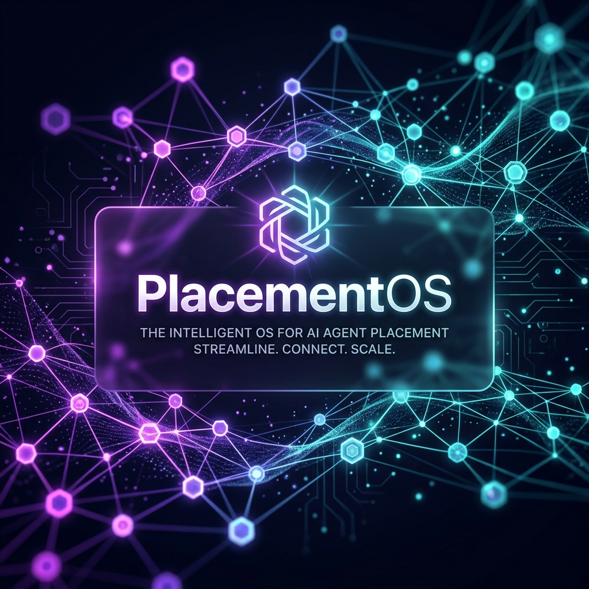
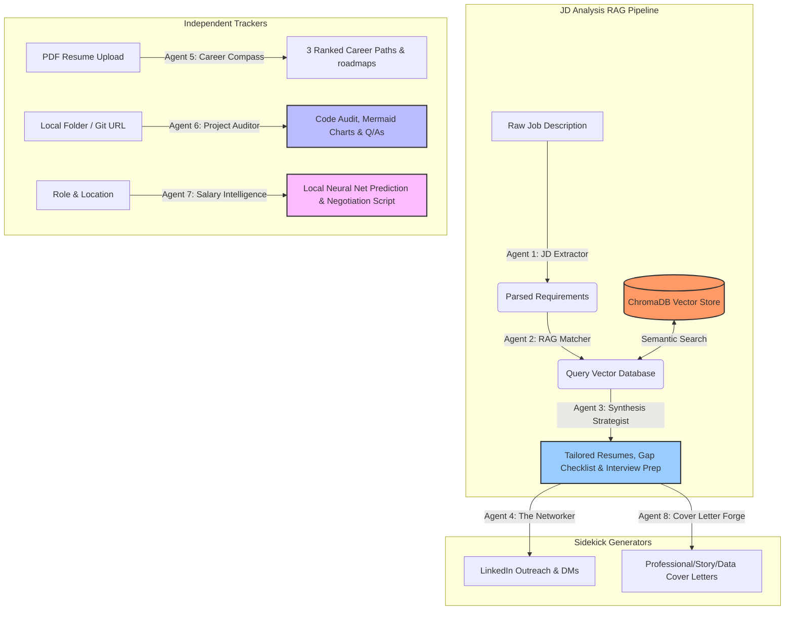

# PlacementOS

<p align="center">
  
</p>

<p align="center">
  
  
  
  
  
  
  
</p>

PlacementOS is a local-first, AI-powered career command center. It replaces generic job application advice with multi-agent RAG architectures that analyze your actual source code, experience portfolio, and the real-world job market to help you land offers faster, optimize your application funnel, and negotiate higher compensation.

---

## 🎨 Visual Tour

<p align="center">
  
</p>

---

## 🤖 The Multi-Agent Orchestration Engine

PlacementOS is powered by a suite of **8 specialized autonomous agents** running on a local FastAPI backend, combining LLM reasoning, semantic search, and custom neural networks.

### 🔄 The RAG Analysis Loop (Agents 1-3)
1. **Agent 1: JD Extractor**: Asynchronously parses raw Job Description text. Leverages Gemini's structured outputs to extract required hard skills, soft skills, and latent engineering requirements (e.g., system scaling, query optimization, handling legacy migrations).
2. **Agent 2: RAG Matcher**: Converts extracted terms into embeddings, then queries the local **ChromaDB** database to retrieve the top 5 most relevant personal projects.
3. **Agent 3: Synthesis Strategist**: Cross-references requirements with retrieved project metadata. It calculates a strict compatibility score (0-100), outputs a detailed alignment checklist, writes tailored, ATS-friendly resume bullets using the **Google X-Y-Z formula** (*Accomplished [X], as measured by [Y], by doing [Z]*), and builds a target interview prep study plan.

### ✉️ Target Generative Aids (Agents 4 & 8)
*   **Agent 4: The Networker**: Ingests analysis results and drafts highly personalized LinkedIn outreach sequences (strictly under 300 characters for connection invites) and cold follow-up messages tailored to a Casual, Professional, or Confident tone.
*   **Agent 8: Cover Letter Forge**: Automatically imports tailored resume bullets to craft compelling, non-generic cover letters. Supports **Professional**, **Story-Driven**, or **Data-First** writing styles.

### 🧭 Career & Code Auditors (Agents 5 & 6)
*   **Agent 5: Career Compass**: Accepts PDF resume uploads, parses content using `pdfplumber`, maps competencies, and identifies the candidate's top 3 ideal career pathways—complete with an ordered learning roadmap to close skill gaps.
*   **Agent 6: Project Auditor & Explainer**: Scans local codebase directories, pasted snippets, or clones public GitHub repositories. Generates a structural architectural overview, writes a valid **Mermaid.js** flowchart, creates tough project-defense interview questions with mock answers, and formulates optimization recommendations.

### 📊 Local Machine Learning (Agent 7)
*   **Agent 7: Salary Intelligence**: Feeds role title, location, and seniority parameters into a **locally trained TensorFlow/Keras neural network regression model**. Predicts base salary bands (P25 to P75), total compensations, equity norms, and outputs a verbatim negotiation script.

---

## 🏗️ System Architecture



---

## 🛠️ Tech Stack

### Frontend (Bento-Box Design System)
*   **React 19 & Vite 8**: High-performance rendering and hot-module reloading.
*   **Vanilla CSS 3**: Utility-free styling framework leveraging modern design details: HSL palettes, glassmorphism overlays, custom shadows, and dynamic micro-animations.
*   **Firebase Client SDK**: Secure, client-side authentication and session management.
*   **html2canvas & jsPDF**: Client-side conversion tools for generating clean PDF exports of JD analysis reports.

### Backend (Local-First AI & ML)
*   **FastAPI**: Asynchronous, high-performance web framework.
*   **Google GenAI SDK**: Utilizing `gemini-1.5-flash` or `gemini-2.5-flash` for agent reasoning, and `gemini-embedding-2` for generating dense semantic vector representations.
*   **ChromaDB**: SQLite-backed local vector database for indexing and searching your career portfolio.
*   **TensorFlow & Keras**: Local model inference engine supporting neural networks trained on market compensation datasets.
*   **pdfplumber**: Python package for local PDF text extraction.

---

## 📁 Repository Structure

```
PlacementOS/
├── backend/                        # FastAPI Backend (Python)
│   ├── app/
│   │   ├── agents.py               # The 8 AI Agent Definitions
│   │   ├── config.py               # Pydantic environment configurations
│   │   ├── main.py                 # FastAPI endpoints & Lifespan seeding
│   │   ├── schemas.py              # Pydantic schema validation structures
│   │   ├── vector_store.py         # ChromaDB interface & embeddings
│   │   └── dl_salary.py            # Local Keras model inference
│   ├── data/
│   │   ├── chroma/                 # Local vector database storage
│   │   └── india_salary_raw.json   # Base dataset for salary model
│   ├── models/
│   │   └── salary_india_dl_model.h5 # Trained Keras neural network model
│   ├── scripts/
│   │   ├── fetch_india_salary_data.py # Scraping/generation script
│   │   └── train_salary_dl_model.py # Keras training script
│   ├── .env                        # Local Gemini backend environment config
│   ├── portfolio.json              # Seed project data
│   └── requirements.txt            # Python dependencies
│
├── frontend/                       # React 19 Frontend (Vite)
│   ├── components/                 # React component library
│   │   ├── features/               # Bento components (Dashboard, CareerCompass, JDAnalyzer...)
│   │   ├── layout/                 # Sidebar and layout structures
│   │   └── shared/                 # Modals and auth overlays
│   ├── services/
│   │   └── firebase.js             # Firebase auth integrations
│   ├── App.jsx                     # Core UI controller & tab router
│   ├── index.css                   # Premium CSS styles & bento layouts
│   └── main.jsx                    # React entrypoint
│
├── public/                         # Public client-side assets
│   ├── images/
│   │   ├── placementos_banner.png  # UI header asset
│   │   └── dashboard_mockup.png    # Dashboard preview mockup
│   ├── favicon.svg                 # App icon
│   └── icons.svg                   # UI iconography
│
├── .env                            # Client-side Firebase credentials
├── index.html                      # HTML entrypoint
├── package.json                    # Node dependencies
├── vite.config.js                  # Vite builder settings
└── eslint.config.js                # Linter configs
```

---

## 💻 Local Setup Guide

### 1. Clone the Repository
```bash
git clone https://github.com/yourusername/PlacementOS.git
cd PlacementOS
```

### 2. Backend Setup
1. Navigate to the `backend/` directory:
   ```bash
   cd backend
   ```
2. Create and activate a Python virtual environment:
   ```bash
   # On macOS/Linux:
   python -m venv .venv
   source .venv/bin/activate

   # On Windows:
   python -m venv .venv
   .venv\Scripts\activate
   ```
3. Install dependencies:
   ```bash
   pip install -r requirements.txt
   ```
4. Set up environment variables:
   Create a `backend/.env` file with your details (a template is available in backend):
   ```env
   GEMINI_API_KEY=your_gemini_api_key_here
   GEMINI_MODEL=gemini-2.5-flash
   EMBEDDING_MODEL=gemini-embedding-2
   HOST=0.0.0.0
   PORT=8000
   CHROMA_DB_DIR=data/chroma
   PORTFOLIO_JSON_PATH=portfolio.json
   ```
5. Start the FastAPI development server:
   ```bash
   uvicorn app.main:app --reload --port 8000
   ```
   > **Note:** On startup, the backend automatically reads `portfolio.json`, generates embeddings using `gemini-embedding-2`, and indexes them in ChromaDB.

### 3. Frontend Setup
1. In a new terminal, navigate to the project root:
   ```bash
   cd PlacementOS
   ```
2. Install npm packages:
   ```bash
   npm install
   ```
3. Set up frontend environment variables:
   Create a `.env` file in the root directory:
   ```env
   VITE_FIREBASE_API_KEY=your_firebase_api_key
   VITE_FIREBASE_AUTH_DOMAIN=your_firebase_auth_domain
   VITE_FIREBASE_PROJECT_ID=your_firebase_project_id
   VITE_FIREBASE_STORAGE_BUCKET=your_firebase_storage_bucket
   VITE_FIREBASE_MESSAGING_SENDER_ID=your_firebase_sender_id
   VITE_FIREBASE_APP_ID=your_firebase_app_id
   ```
4. Start the Vite development server:
   ```bash
   npm run dev
   ```

### 4. Run the Application
Open `http://localhost:5173` in your browser. The app runs completely locally, storing your trackers in `localStorage` and vector data inside `backend/data/chroma`.

---

## 🛠️ Under the Hood

### Asynchronous Multi-Agent Chaining
Each agent in the pipeline relies on the official `google-genai` SDK using `gemini-2.5-flash`'s structured JSON output mode. By providing Pydantic response models, PlacementOS guarantees output structure validation:
```python
response = await self.genai_client.aio.models.generate_content(
    model=settings.gemini_model,
    contents=prompt,
    config=types.GenerateContentConfig(
        response_mime_type="application/json",
        response_schema=JDExtractedData,
        temperature=0.1
    )
)
```

### Local Neural Network Compensation Analysis
The Salary Intelligence page references a local Deep Learning regression model compiled with Keras. Feature columns like `role`, `location`, and `seniority` are preprocessed via one-hot encoding, matching the training schema configured in `backend/scripts/train_salary_dl_model.py`. This predictions system runs entirely offline on your local machine, protecting user privacy.


*Built as a personal command center to conquer the modern job market.*
