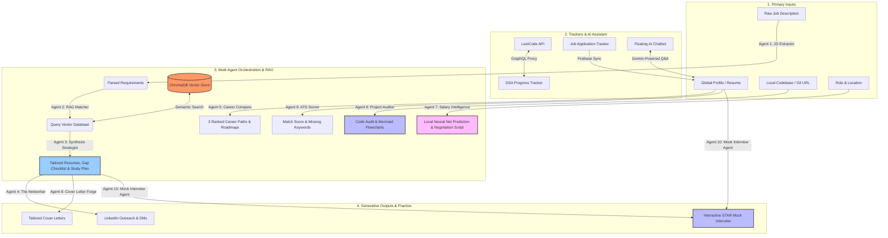

<div align="center">
  <h1>PlacementOS</h1>
  <p><i>A local-first, AI-powered career command center.</i></p>

  <!-- GitHub Badges -->
  <p>
    <a href="https://github.com/vansh070605/PlacementOS/stargazers"></a>
    <a href="https://github.com/vansh070605/PlacementOS/network/members"></a>
    <a href="https://github.com/vansh070605/PlacementOS/issues"></a>
    <a href="https://github.com/vansh070605/PlacementOS/blob/main/LICENSE"></a>
    <a href="https://github.com/vansh070605/PlacementOS/graphs/contributors"></a>
    <a href="https://github.com/vansh070605/PlacementOS/commits/main"></a>
  </p>

  <!-- Tech Stack Badges -->
  <p>
    
    
    
    
    
    
    
    
  </p>
</div>

**PlacementOS** is a comprehensive, local-first career management platform. It transcends traditional job application tracking by leveraging a multi-agent Retrieval-Augmented Generation (RAG) architecture. By actively analyzing your source code, professional portfolio, and real-time job market data, PlacementOS provides targeted insights to optimize your application funnel, accelerate interview preparation, and maximize compensation negotiations.

---


## Key Features

### Unified Candidate Profile
At the core of PlacementOS is the **Global Candidate Profile**, synchronized in real-time via Firebase. Build your profile once—including biometrics, contact details, repository links, and technical competencies. Our suite of AI agents directly consume this living profile as contextual memory, dynamically formatting it into markdown for prompt injection. This eliminates redundant data entry and ensures the AI operates strictly on your latest accomplishments. *(Manual PDF uploads are supported as an override).*

### Job Application Tracker
An interactive Kanban board designed to organize, track, and prioritize your application funnel. Monitor roles by lifecycle status (Applied, Interviewing, Offered, Rejected), track chronological progression, document compensation ranges, and log interview focus areas.

### DSA & LeetCode Progress Tracker
A specialized workspace engineered for Data Structures & Algorithms preparation. It monitors proficiency across core paradigms (Arrays, Strings, Trees, Graphs, DP, System Design). Our built-in LeetCode submissions proxy automatically syncs your accepted solutions, resolving difficulty parameters and topic tags via public GraphQL integrations.

### Floating AI Career Assistant
A pervasive chat interface accessible across all module screens. Powered by Gemini, the assistant provides immediate contextual heuristics for DSA strategies, resume optimization, career trajectories, and interview defense tactics, dynamically scoped to your unified profile.

---

## Orchestration Engine

PlacementOS is driven by a localized FastAPI backend orchestrating **10 specialized autonomous agents**. This system harmonizes Large Language Model (LLM) reasoning, semantic search, and custom neural networks.

### The RAG Analysis Loop (Agents 1-3)
1. **Agent 1 (JD Extractor):** Asynchronously parses raw Job Description text. Leverages structured outputs to extract explicit hard skills, soft skills, and latent engineering requirements.
2. **Agent 2 (RAG Matcher):** Computes query embeddings to fetch semantically similar project descriptions from ChromaDB. Defaults to remote `gemini-embedding-2` queries to preserve RAM, with offline fallback to a local `all-MiniLM-L6-v2` SentenceTransformer.
3. **Agent 3 (Synthesis Strategist):** Cross-references extracted requirements against retrieved project metadata. Calculates a strict compatibility index (0-100), outputs an alignment checklist, drafts tailored resume bullets using the Google X-Y-Z formula, and synthesizes a targeted study plan.

### Target Generative Aids (Agents 4 & 8)
*   **Agent 4 (The Networker):** Ingests analysis results to draft highly personalized LinkedIn outreach sequences (under 300 characters) and cold email campaigns tailored to Casual, Professional, or Confident tonalities.
*   **Agent 8 (Cover Letter Forge):** Consumes the Candidate Profile and tailored resume bullets to programmatically generate compelling, non-generic cover letters supporting Professional, Story-Driven, or Data-First structures.

### Career, Code, & ATS Auditors (Agents 5, 6, & 9)
*   **Agent 5 (Career Compass):** Utilizes the unified profile to map competencies against ideal career pathways, outputting an ordered learning roadmap to bridge identified skill gaps.
*   **Agent 6 (Project Auditor):** Scans local codebase directories or public GitHub repositories. Generates architectural overviews, writes valid `Mermaid.js` flowcharts, formulates defensive interview questions, and provides optimization recommendations.
*   **Agent 9 (ATS Scorer):** Simulates an Applicant Tracking System (ATS) parsing engine. Compares the profile against target JDs to generate a Match Score, parsing heuristics, and granular keyword gap analysis.

### Local Machine Learning & Live Practice (Agents 7 & 10)
*   **Agent 7 (Salary Intelligence):** Feeds parameters into a locally trained TensorFlow/Keras neural network regression model to predict base salary bands (P25-P75), total compensation, and equity norms, supplemented by a generated negotiation script.
*   **Agent 10 (Mock Interviewer):** Functions as an interactive technical or behavioral interviewer. Evaluates responses using the STAR method and dynamically generates progressive follow-up questions.

---

## System Architecture



---

## Tech Stack

### Frontend (Bento-Box Design System)
*   **React 19 & Vite 8:** High-performance rendering and hot-module reloading.
*   **Tailwind CSS v4:** Utility-first styling toolchain integrated into Vite.
*   **Vanilla CSS 3:** Custom layout components leveraging HSL tokens, glassmorphism, dynamic micro-animations, and theme variables.
*   **Firebase SDK:** Secure authentication and real-time syncing.
*   **React Context API:** Global state management for seamless agent data sharing.

### Backend (Local-First AI & ML)
*   **FastAPI:** Asynchronous, high-performance Python web framework.
*   **Google GenAI SDK:** Configured for `gemini-1.5-flash` for multi-agent reasoning, safety filtering, and JSON schema enforcement.
*   **PyTorch & Hugging Face:** Powers local token classification (BERT NER), sentence embeddings, Cross-Encoders, and local Causal Language Models (Qwen).
*   **Scikit-Learn:** Classical machine learning pipelines (Random Forest classification).
*   **ChromaDB:** SQLite-backed local vector database for portfolio indexing.
*   **TensorFlow & Keras:** Local model inference engine supporting neural networks trained on market compensation datasets.
*   **pdfplumber:** Python package for local PDF text extraction.

---

## Installation Guide

### 1. Clone the Repository
```bash
git clone https://github.com/vansh070605/PlacementOS.git
cd PlacementOS
```

### 2. Backend Setup
1. Navigate to the `backend/` directory:
   ```bash
   cd backend
   ```
2. Create and activate a Python virtual environment:
   ```bash
   # On macOS/Linux:
   python -m venv .venv
   source .venv/bin/activate

   # On Windows:
   python -m venv .venv
   .venv\Scripts\activate
   ```
3. Install dependencies:
   ```bash
   pip install -r requirements.txt
   ```
4. Configure environment variables in `backend/.env`:
   ```env
   GEMINI_API_KEY=your_gemini_api_key_here
   GEMINI_MODEL=gemini-1.5-flash
   LOCAL_EMBEDDING_MODEL=all-MiniLM-L6-v2
   HOST=0.0.0.0
   PORT=8000
   CHROMA_DB_DIR=data/chroma
   PORTFOLIO_JSON_PATH=portfolio.json
   ```
5. Start the FastAPI development server:
   ```bash
   uvicorn app.main:app --reload --port 8000
   ```
   > **Note:** On startup, the backend reads `portfolio.json`, generates embeddings, and indexes them in ChromaDB.

### 3. Frontend Setup
1. Navigate to the project root in a new terminal:
   ```bash
   cd frontend
   ```
2. Install npm packages:
   ```bash
   npm install
   ```
3. Configure environment variables in `frontend/.env`:
   ```env
   VITE_FIREBASE_API_KEY=your_firebase_api_key
   VITE_FIREBASE_AUTH_DOMAIN=your_firebase_auth_domain
   VITE_FIREBASE_PROJECT_ID=your_firebase_project_id
   VITE_FIREBASE_STORAGE_BUCKET=your_firebase_storage_bucket
   VITE_FIREBASE_MESSAGING_SENDER_ID=your_firebase_sender_id
   VITE_FIREBASE_APP_ID=your_firebase_app_id
   ```
4. Start the Vite development server:
   ```bash
   npm run dev
   ```

Open `http://localhost:5173` in your browser. The application runs locally, storing trackers in Firebase and vector data inside `backend/data/chroma`.

---

## Under the Hood

### Asynchronous Multi-Agent Chaining
Each agent in the pipeline relies on the official `google-genai` SDK using structured JSON output modes. By enforcing Pydantic response models, PlacementOS guarantees output structure validation. All external LLM calls are throttled and protected from rate-limiting at a centralized entry point.

### Concurrency Throttling & Protections
*   **Zero-Footprint Embeddings:** Offloads embedding tasks to the Gemini API (`gemini-embedding-2`) by default, drastically reducing server RAM usage for low-spec deployment.
*   **Concurrency Throttling:** An `asyncio.Semaphore(3)` cap prevents concurrent threshold breaches.
*   **Exponential Backoff:** Implemented via `tenacity` retries (up to 5 attempts) specifically targeted at `429 Resource Exhausted` exceptions.
*   **Strict Security Posture:** Implements strict Gemini `safety_settings` to prevent prompt injections and policy violations.

### Local Neural Network Compensation Analysis
The Salary Intelligence module references a local Deep Learning regression model compiled with Keras. Feature columns (`role`, `location`, `seniority`) are preprocessed via one-hot encoding, strictly matching the training schema configured in `backend/scripts/train_salary_dl_model.py`. This system operates entirely offline, prioritizing user privacy.

### Local Hybrid AI & Model Registry (Fallbacks)
To ensure reliability under offline constraints or API rate limits, PlacementOS utilizes a centralized `LocalModelRegistry` that lazily loads models onto CUDA (GPU) or CPU:
*   **Generative LLM:** Hugging Face pipeline wrapping `Qwen/Qwen2.5-1.5B-Instruct` for local agent inference.
*   **ATS Cross-Encoder Scorer:** Employs `cross-encoder/ms-marco-MiniLM-L-6-v2` for high-precision semantic matching.
*   **Career Compass Classifier:** Scikit-Learn `RandomForestClassifier` pipeline predicting job families based on keyword vectors.
*   **BERT NER Extractor:** `dslim/bert-base-NER` for local entity extraction on job descriptions.

---

## Community & Support

### Contributing
We welcome contributions from the community. Please review our [Contributing Guide](CONTRIBUTING.md) to understand our development workflow, branch naming rules, and pull request guidelines. By participating, you agree to abide by our [Code of Conduct](CODE_OF_CONDUCT.md).

### License
This project is licensed under the MIT License - see the [LICENSE](LICENSE) file for details.

### Support
Encountered an issue or have a question?
- Read our [Support Document](SUPPORT.md)
- Open an [Issue](https://github.com/vansh070605/PlacementOS/issues)

---
*Built to conquer the modern job market.*
