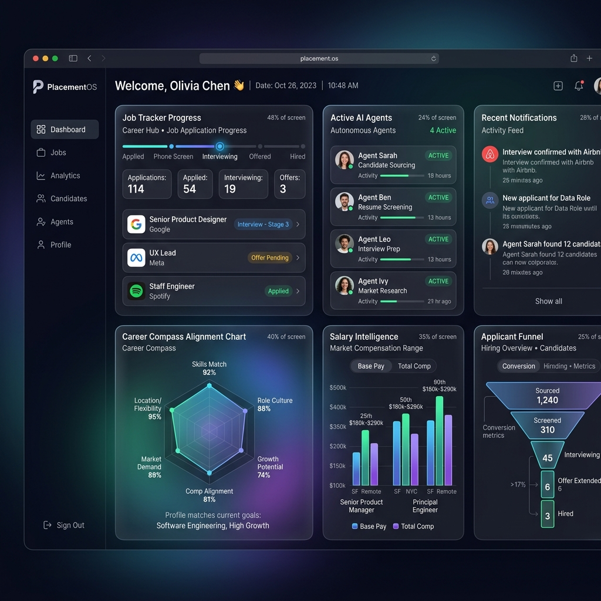
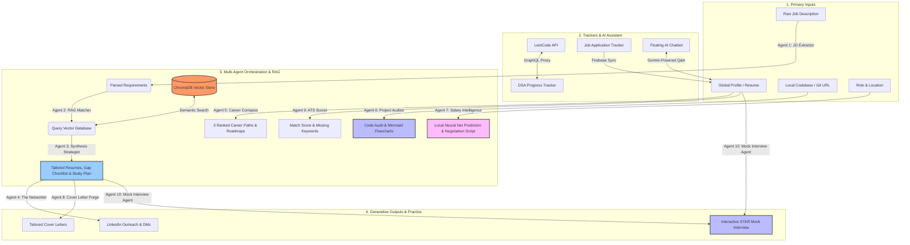

# PlacementOS

<p align="center">
  
</p>

<p align="center">
  
  
  
  
  
  
  
  
</p>

PlacementOS is a local-first, AI-powered career command center. It replaces generic job application advice with multi-agent RAG architectures that analyze your actual source code, experience portfolio, and the real-world job market to help you land offers faster, optimize your application funnel, and negotiate higher compensation.

---

## 🎨 Visual Tour

<p align="center">
  
</p>

---

## 🚀 Key Features

### 👤 Unified Candidate Profile
At the core of PlacementOS is the **Global Candidate Profile**. Powered by Firebase, you build your profile once—adding your bio, contact info, GitHub/LinkedIn links, and technical skills—and it syncs universally across the entire application in real-time. Instead of constantly uploading a static PDF resume, our suite of AI agents directly consume this living profile as context, converting it dynamically into markdown to inject into prompts, saving you time and ensuring the AI is always operating on your most up-to-date accomplishments. (Of course, manual PDF uploads are still fully supported as an override!)

### 📊 Job Application Tracker
An interactive Kanban board and list system allowing you to organize, track, and prioritize your job application funnel. Track roles by status (Applied, Interviewing, Offered, Rejected), dates, compensation range, and keep notes on interview focus areas.

### 📝 DSA & LeetCode Progress Tracker
A specialized workspace designed to track your Data Structures & Algorithms preparation. It monitors major topics (Arrays, Strings, Trees, Graphs, DP, System Design) and features direct LeetCode integration. Using our built-in LeetCode submissions proxy, you can sync your accepted LeetCode solutions, automatically resolving difficulty parameters and topic tags via a public GraphQL connection.

### 💬 Floating AI Career Assistant
A floating chat interface accessible across all screens. Powered by Gemini, the assistant provides immediate contextual hints for DSA, resume optimization, career advice, and interview question defense, customized by your unified profile and application history.

---

## 🤖 The Multi-Agent Orchestration Engine

PlacementOS is powered by a suite of **10 specialized autonomous agents** running on a local FastAPI backend, combining LLM reasoning, semantic search, and custom neural networks.

### 🔄 The RAG Analysis Loop (Agents 1-3)
1. **Agent 1: JD Extractor**: Asynchronously parses raw Job Description text. Leverages Gemini's structured outputs to extract required hard skills, soft skills, and latent engineering requirements.
2. **Agent 2: RAG Matcher**: Computes query embeddings to fetch similar project descriptions from ChromaDB. By default, it runs remote **`gemini-embedding-2`** queries (minimizing local RAM requirements) but supports switching to a local **SentenceTransformer (`all-MiniLM-L6-v2`)** model when offline. It retrieves the top 5 most relevant personal projects.
3. **Agent 3: Synthesis Strategist**: Cross-references requirements with retrieved project metadata. It calculates a strict compatibility score (0-100), outputs a detailed alignment checklist, writes tailored, ATS-friendly resume bullets using the **Google X-Y-Z formula**, and builds a target interview prep study plan.

### ✉️ Target Generative Aids (Agents 4 & 8)
*   **Agent 4: The Networker (Cold Email/LinkedIn Generator)**: Ingests analysis results and drafts highly personalized LinkedIn outreach sequences (strictly under 300 characters) and cold follow-up emails tailored to Casual, Professional, or Confident tones.
*   **Agent 8: Cover Letter Forge**: Automatically consumes your **Candidate Profile** and tailored resume bullets to craft compelling, non-generic cover letters. Supports **Professional**, **Story-Driven**, or **Data-First** writing styles.

### 🧭 Career, Code, & ATS Auditors (Agents 5, 6, & 9)
*   **Agent 5: Career Compass**: Utilizes your unified Profile (or a PDF upload) to map your competencies and identify your top 3 ideal career pathways—complete with an ordered learning roadmap to close skill gaps.
*   **Agent 6: Project Auditor & Explainer**: Scans local codebase directories, pasted snippets, or clones public GitHub repositories. Generates a structural architectural overview, writes a valid **Mermaid.js** flowchart, creates tough project-defense interview questions with mock answers, and formulates optimization recommendations.
*   **Agent 9: ATS Scorer**: Simulates a strict Applicant Tracking System (ATS). Compares your profile/resume against a target JD to provide a Match Score (0-100), overall verdict, parsing issue feedback, and lists of matched/missing keywords.

### 📊 Local Machine Learning & Live Practice (Agents 7 & 10)
*   **Agent 7: Salary Intelligence**: Feeds role title, location, and seniority parameters into a **locally trained TensorFlow/Keras neural network regression model** to predict base salary bands (P25 to P75), total compensations, and equity norms. It also interfaces with Gemini to output a verbatim negotiation script.
*   **Agent 10: Mock Interview Agent**: Acts as an interactive technical or behavioral interviewer. It consumes the target job description and your candidate profile, evaluates your answers using the STAR method, and asks progressive follow-up questions. Tones can be toggled between **Professional**, **Roast/Critique Reviewer**, and **Encouraging Mentor**.

---

## 🏗️ System Architecture



---

## 🛠️ Tech Stack

### Frontend (Bento-Box Design System)
*   **React 19 & Vite 8**: High-performance rendering and hot-module reloading.
*   **Tailwind CSS v4**: Utility-first styling toolchain integrated into Vite.
*   **Vanilla CSS 3**: Custom layout components and interactive designs leveraging HSL tokens, glassmorphism, dynamic micro-animations, and theme variables.
*   **Firebase SDK**: Secure authentication and real-time syncing of the Candidate Profile.
*   **React Context API**: Global state management (`ProfileContext`) for seamless agent data sharing.

### Backend (Local-First AI & ML)
*   **FastAPI**: Asynchronous, high-performance Python web framework.
*   **Google GenAI SDK**: Utilizing **`gemini-1.5-flash`** by default (with configuration support for `gemini-2.5-flash` / `gemini-1.5-pro`) for multi-agent reasoning, safety filtering, and JSON schemas.
*   **ChromaDB**: SQLite-backed local vector database for indexing and searching your career portfolio.
*   **Custom Gemini Embedding Function**: Runs remote `gemini-embedding-2` calls to preserve local RAM usage (optional configuration for local `all-MiniLM-L6-v2` SentenceTransformers).
*   **TensorFlow & Keras**: Local model inference engine supporting neural networks trained on market compensation datasets.
*   **pdfplumber**: Python package for local PDF text extraction.

---

## 💻 Local Setup Guide

### 1. Clone the Repository
```bash
git clone https://github.com/yourusername/PlacementOS.git
cd PlacementOS
```

### 2. Backend Setup
1. Navigate to the `backend/` directory:
   ```bash
   cd backend
   ```
2. Create and activate a Python virtual environment:
   ```bash
   # On macOS/Linux:
   python -m venv .venv
   source .venv/bin/activate

   # On Windows:
   python -m venv .venv
   .venv\Scripts\activate
   ```
3. Install dependencies:
   ```bash
   pip install -r requirements.txt
   ```
4. Set up environment variables:
   Create a `backend/.env` file in the `backend/` folder:
   ```env
   GEMINI_API_KEY=your_gemini_api_key_here
   GEMINI_MODEL=gemini-1.5-flash
   LOCAL_EMBEDDING_MODEL=all-MiniLM-L6-v2
   HOST=0.0.0.0
   PORT=8000
   CHROMA_DB_DIR=data/chroma
   PORTFOLIO_JSON_PATH=portfolio.json
   ```
5. Start the FastAPI development server:
   ```bash
   uvicorn app.main:app --reload --port 8000
   ```
   > **Note:** On startup, the backend automatically reads `portfolio.json`, generates embeddings using the configured embedding function, and indexes them in ChromaDB. Ensure your `GEMINI_API_KEY` is configured.

### 3. Frontend Setup
1. In a new terminal, navigate to the project root:
   ```bash
   cd PlacementOS/frontend
   ```
2. Install npm packages:
   ```bash
   npm install
   ```
3. Set up frontend environment variables:
   Create a `.env` file in the `frontend/` directory:
   ```env
   VITE_FIREBASE_API_KEY=your_firebase_api_key
   VITE_FIREBASE_AUTH_DOMAIN=your_firebase_auth_domain
   VITE_FIREBASE_PROJECT_ID=your_firebase_project_id
   VITE_FIREBASE_STORAGE_BUCKET=your_firebase_storage_bucket
   VITE_FIREBASE_MESSAGING_SENDER_ID=your_firebase_sender_id
   VITE_FIREBASE_APP_ID=your_firebase_app_id
   ```
4. Start the Vite development server:
   ```bash
   npm run dev
   ```

### 4. Run the Application
Open `http://localhost:5173` in your browser. The app runs locally, storing your trackers in Firebase and vector data inside `backend/data/chroma`.

---

## 🛡️ Under the Hood

### Asynchronous Multi-Agent Chaining
Each agent in the pipeline relies on the official `google-genai` SDK using `gemini-1.5-flash`'s structured JSON output mode. By providing Pydantic response models, PlacementOS guarantees output structure validation. All Gemini calls are throttled and protected from rate-limiting at a central entry point.

### Concurrency Throttling & Protections
*   **Zero-Footprint Embeddings**: Offloads embedding tasks to the Gemini API (`gemini-embedding-2`) by default to dramatically reduce server RAM usage, making it deployable on low-spec cloud platforms.
*   **Concurrency Throttling**: An `asyncio.Semaphore(3)` cap prevents more than 3 agents from calling Gemini concurrently.
*   **Exponential Backoff**: Wrapped with `tenacity` retries (up to 5 attempts, doubling wait times) specifically targeted at `429 Resource Exhausted` exceptions.
*   **Strict Security Posture**: Implements strict Gemini `safety_settings` against block thresholds to prevent prompt injections or policy violations.

### Local Neural Network Compensation Analysis
The Salary Intelligence page references a local Deep Learning regression model compiled with Keras. Feature columns like `role`, `location`, and `seniority` are preprocessed via one-hot encoding, matching the training schema configured in `backend/scripts/train_salary_dl_model.py`. This prediction system runs entirely offline on your local machine, protecting user privacy.

*Built as a personal career command center to conquer the modern job market.*
